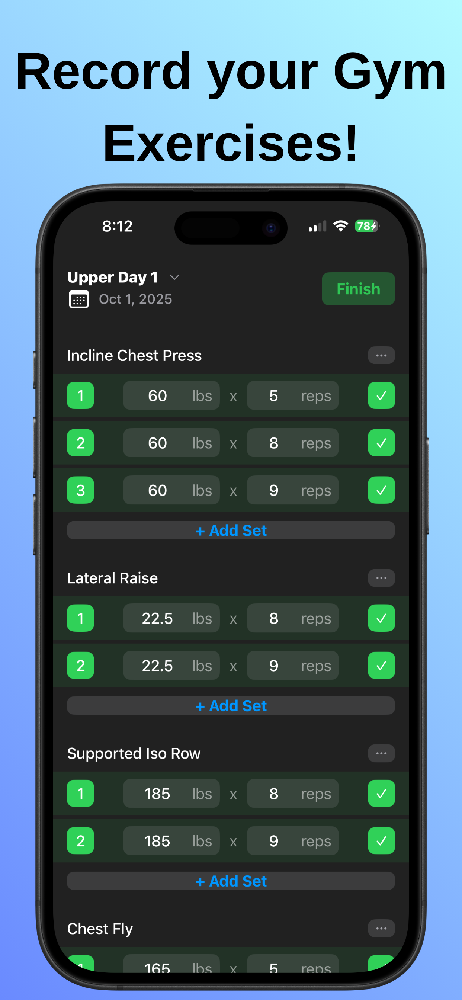
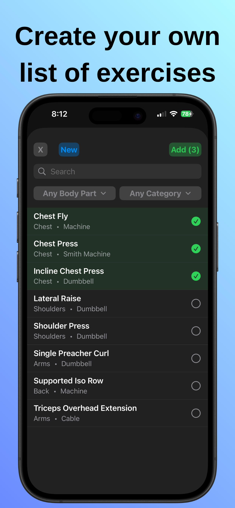
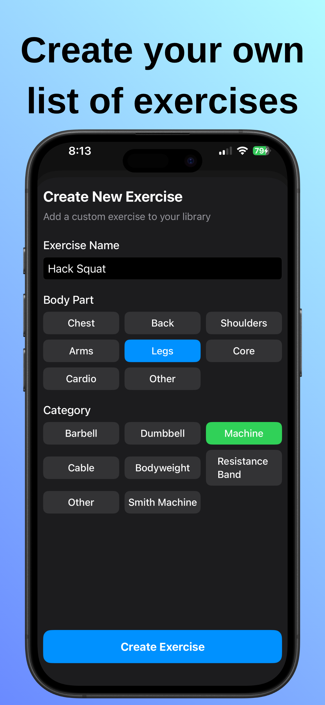
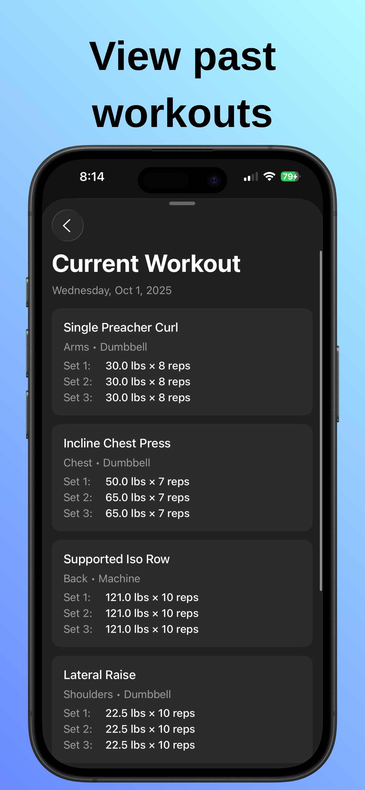
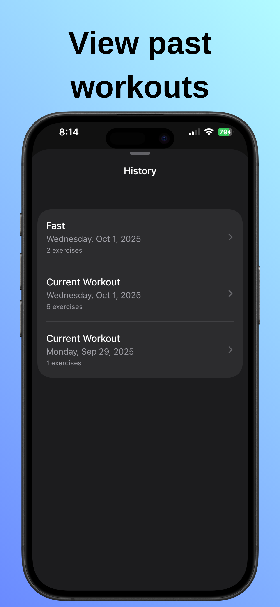

Download Lift Notes for iPhone [here](https://apps.apple.com/us/app/lift-notes-gym-tracker/id6753324391)
## Welcome to Lift Notes!
#### The simple and striaghtforward solution to keeping track of your gym workouts in one app!
- Start a New Workout

- Create and Add New Exercises

- Save Workout to History

- Create Templates from Completed Workouts for future Use

- More Features Coming!
## To-Do
- See 'previous' reps and weight done for each exercise
- Use SwiftCharts to display progress overtime (PR's for exercises, possible weight tracking)
- Enhance UX with Lottie Animations
- Migrate to iOS 26 Glass Design
- Fix Bugs!
